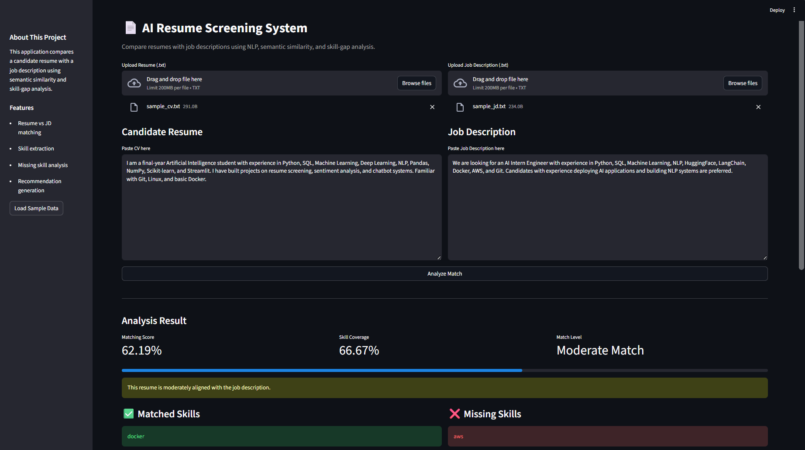
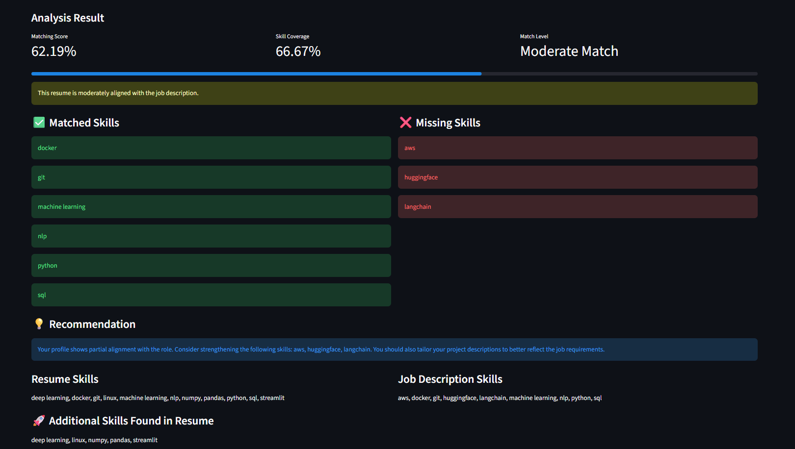

# 📄 AI Resume Screening System

> An NLP-based application that evaluates how well a candidate’s resume matches a job description using semantic similarity and skill-gap analysis.

---

## 🚀 Overview

This project is an end-to-end **AI-powered resume screening system** that helps analyze the alignment between a candidate's resume and a job description.

It leverages **semantic similarity** and **keyword-based skill extraction** to provide:

- 📊 Matching score
- 🧠 Skill overlap analysis
- ❌ Missing skills detection
- 💡 Actionable recommendations

The system is designed to simulate real-world **AI-assisted recruitment tools**.

---

## ✨ Key Features

- 🔍 **Semantic Matching** using Sentence Transformers
- 🧠 **Skill Extraction Engine** (AI/ML-focused keywords)
- 📊 **Match Score Visualization**
- ❌ **Missing Skill Detection**
- 💡 **Resume Improvement Suggestions**
- 🖥️ **Interactive Web App (Streamlit)**
- 📁 **File Upload Support (.txt)**

---

## 🖼️ Demo

### 🧾 Input Interface



### 📊 Analysis Result



---

## 🏗️ System Architecture

```text
Resume + Job Description
          │
          ▼
   Text Preprocessing
          │
          ▼
 Sentence Embedding Model
 (MiniLM Transformer)
          │
          ▼
   Cosine Similarity
          │
          ▼
 Skill Extraction Engine
          │
          ▼
   Analysis Output
(score + skills + recommendations)
```

---

## ⚙️ Tech Stack

| Component        | Technology                   |
| ---------------- | ---------------------------- |
| Frontend         | Streamlit                    |
| NLP Model        | Sentence Transformers        |
| Similarity       | Cosine Similarity (sklearn)  |
| Skill Extraction | Regex-based keyword matching |
| Language         | Python                       |

---

## 📂 Project Structure

```text
resume-screening-ai/
├── app.py
├── utils.py
├── skill_extractor.py
├── requirements.txt
├── README.md
├── .gitignore
├── sample_data/
│   ├── sample_cv.txt
│   └── sample_jd.txt
└── assets/
    ├── demo_1.png
    └── demo_2.png
```

---

## 🔄 How It Works

1. Input resume text
2. Input job description
3. Convert both texts into embeddings
4. Compute semantic similarity score
5. Extract skills from both texts
6. Compare skill overlap
7. Identify missing skills
8. Generate recommendations

---

## 🛠️ Installation

### 1. Clone the repository

```bash
git clone https://github.com/tiennguyen0401/ai-resume-screening-system.git
cd ai-resume-screening-system
```

### 2. Create virtual environment

```bash
python -m venv venv
```

### 3. Activate environment

#### Windows

```bash
venv\Scripts\activate
```

#### macOS/Linux

```bash
source venv/bin/activate
```

### 4. Install dependencies

```bash
pip install -r requirements.txt
```

---

## ▶️ Run the App

```bash
streamlit run app.py
```

---

## 💡 Example Use Case

- Compare your CV with an AI Engineer job description
- Identify missing skills before applying
- Improve resume relevance for ATS systems

---

## 📌 Notes

- Works best with structured CV text
- Skill extraction is rule-based (can be improved with NLP models)
- Designed for educational and portfolio purposes

---

## 🔮 Future Improvements

- PDF/DOCX resume parsing
- Advanced NLP-based skill extraction (spaCy)
- Resume ranking system
- Job recommendation engine
- Integration with LinkedIn profiles

---

## 🧠 What I Learned

- Semantic similarity using transformer models
- NLP pipeline design
- Feature engineering for skill extraction
- Building interactive ML apps with Streamlit
- Structuring projects for real-world use

---

## 👤 Author

**Nguyen Trong Tien**

---

## ⭐ If you find this project useful

Give it a ⭐ on GitHub!

---

## 📄 Resume Description

Built an NLP-based resume screening system using Sentence Transformers and Streamlit to evaluate resume-job alignment through semantic similarity, skill extraction, and recommendation generation.
